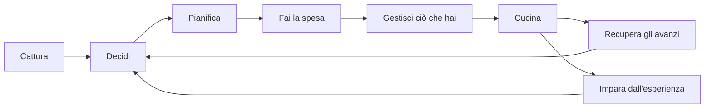

# Possible Future Enhancements

> Catalogo ragionato delle evoluzioni possibili per Tavola.
>
> Stato della ricerca: 10 agosto 2026. Questo documento non è una roadmap vincolante e non richiede di scegliere subito cosa costruire. È una riserva di idee concrete, pensate per poter essere riprese quando il numero di ricette, gli usi quotidiani e le esigenze del prodotto cresceranno.

## 1. Perché esiste questo documento

Tavola non deve diventare semplicemente un archivio più grande. Il suo potenziale è chiudere bene l'intero ciclo domestico del cibo:



Il prodotto è già forte nel tratto **decidi → consulta → cucina**. Le evoluzioni più interessanti servono a:

- far crescere il patrimonio di ricette senza trasformare l'inserimento in un lavoro;
- rendere la decisione spiegabile e personale, non soltanto casuale;
- sostenere la cucina reale, con mani occupate, tempi paralleli, sostituzioni e imprevisti;
- collegare ricette, piano pasti, spesa, dispensa, avanzi e memoria familiare;
- proteggere i dati, le foto e la provenienza delle ricette nel lungo periodo;
- mantenere il sistema semplice e poco costoso anche con centinaia o migliaia di ricette.

## 2. Fotografia dello stato attuale

### 2.1 Capacità già presenti

- Flask e Jinja come stack server-side leggero.
- Supabase PostgreSQL come fonte persistente di produzione.
- Supabase Storage per fotografie vere e pubbliche.
- Fallback locale su `recipes.json` e `static/uploads` in sviluppo.
- Cinque ricette curate con ingredienti strutturati come `{name, quantity}`.
- Home decision-first, ricerca testuale e filtri.
- Suggerimento casuale filtrabile per alcuni stati d'animo.
- Scheda completa con checklist ingredienti e passaggi.
- Modalità cucina con avanzamento persistito in `localStorage`.
- Screen Wake Lock per mantenere acceso lo schermo.
- Editor guidato con anteprima live, righe ingrediente e foto opzionale.
- Layout fotografico quando esiste una foto vera e layout editoriale quando manca.
- Validazione server delle immagini per estensione, MIME, dimensione e firma binaria.
- Bucket pubblico `recipe-images` con limite di 8 MB.
- Stampa della ricetta e suggerimenti correlati.

### 2.2 Vincoli attuali che influenzano quasi ogni evoluzione

- L'identità di una ricetta dipende ancora dal titolo trasformato in slug; manca un UUID stabile.
- Non esiste modifica, archiviazione o cancellazione dall'interfaccia admin.
- Le istruzioni sono un testo unico e i passaggi vengono ricavati dalla punteggiatura.
- La quantità è ancora una stringa libera, quindi il ridimensionamento delle porzioni non è affidabile.
- Non sono registrati porzioni, resa, tempi attivi/passivi, attrezzatura o temperature.
- Tag e categorie non hanno una tassonomia controllata.
- Non esistono `created_at`, `updated_at`, stato bozza o storico revisioni.
- La ricerca carica tutte le ricette e filtra in Python.
- La password admin è condivisa; non esistono sessioni, CSRF, rate limiting o ruoli.
- Il frontend è volutamente vanilla, senza un framework di stato.
- I test coprono il flusso base, ma non Storage, Supabase, ricerca, immagini o JavaScript.
- Foto caricate senza trasformazioni: niente thumbnail, `srcset`, crop conservati o compressione automatica.

## 3. Principi per decidere bene in futuro

### 3.1 La ricetta originale deve restare umana

Normalizzare non significa distruggere. Testi come “q.b.”, “un filo”, “una manciata”, “finché basta” o “a sentimento” hanno valore culinario. Ogni futura struttura numerica dovrebbe conservare anche il testo originale.

### 3.2 Il sistema deve dichiarare il proprio livello di certezza

- **Certo:** valore inserito e verificato dall'autore.
- **Importato:** valore proveniente da una fonte esplicita.
- **Calcolato:** derivazione matematica da dati verificati.
- **Stimato:** risultato incompleto o basato su corrispondenze probabilistiche.
- **Sconosciuto:** il sistema non dispone di dati sufficienti.

Questo è essenziale per allergeni, nutrizione, costi, conservazione, disponibilità in dispensa e sostituzioni.

### 3.3 Prima il flusso senza account, poi la collaborazione

Molte funzioni possono vivere bene per un singolo nucleo senza autenticazione complessa. Account, famiglie, inviti e realtime hanno senso solo quando esiste un bisogno concreto di collaborazione e richiedono Row Level Security rigorosa.

### 3.4 Progressive enhancement

Timer, voce, installazione PWA, condivisione nativa e Wake Lock devono migliorare l'esperienza quando supportati, senza rendere inutilizzabile il prodotto quando il browser non li offre.

### 3.5 Nessuna automazione deve pubblicare senza revisione

Importazioni da URL, testo, OCR o servizi esterni devono precompilare l'editor. L'utente verifica e pubblica. È più affidabile, protegge la provenienza e limita dati assurdi.

## 4. Legenda di fattibilità

Le stime assumono una persona che conosce la codebase, includendo migrazione, UI e test mirati.

- **S — piccola:** circa 1–3 giorni.
- **M — media:** circa 4–8 giorni.
- **L — ampia:** circa 9–15 giorni.
- **XL — molto ampia ma fattibile:** circa 16–30 giorni, da dividere in fasi.
- **Costo operativo basso:** browser, Supabase e librerie open source.
- **Costo operativo variabile:** API esterne o volumi Storage/egress, da attivare solo con limiti e cache.

---

# Area A — Fondamenta del patrimonio di ricette

## A1. Identità stabile con UUID e slug storico

**Problema.** Titolo e URL sono accoppiati. Rinominare una ricetta può rompere link, progresso locale e riferimenti futuri.

**Esperienza.** Ogni ricetta riceve un'identità immutabile; il titolo può cambiare senza perdere cronologia. I vecchi URL continuano a redirigere.

**Implementazione.**

- aggiungere `id uuid primary key default gen_random_uuid()`;
- aggiungere `slug`, con indice univoco, separato dal titolo;
- mantenere una tabella `recipe_slug_aliases(recipe_id, slug, created_at)`;
- usare l'UUID per progressi, planner, preferiti e relazioni;
- mantenere URL leggibili come `/ricetta/<slug>`.

**MVP.** Migrazione delle cinque righe, lookup prima sullo slug corrente e poi sugli alias.

**Rischi.** Collisioni di slug e link preesistenti. La migrazione deve essere idempotente e testare ogni redirect.

**Fattibilità:** M, costo operativo basso.

## A2. Admin Studio per vedere e modificare tutte le ricette

**Problema.** Le ricette esistenti possono essere corrette solo passando dal database. Questo diventa ingestibile appena il catalogo cresce.

**Esperienza.** `/admin/ricette` mostra una tabella densa con ricerca, stato foto, ultima modifica e azioni: modifica, duplica, archivia, elimina.

**Implementazione.**

- estrarre l'editor attuale in componenti Jinja riutilizzabili per create/edit;
- aggiungere `GET/POST /admin/ricette/<uuid>/modifica`;
- precaricare ingredienti, tag e foto;
- sostituire o rimuovere immagini cancellando l'oggetto Storage precedente solo dopo il salvataggio riuscito;
- usare conferme esplicite per archiviazione ed eliminazione.

**MVP.** Elenco, modifica completa e sostituzione foto. Eliminazione definitiva può aspettare.

**Rischi.** Oggetti Storage orfani, collisioni di titolo e aggiornamenti parziali. Serve una sequenza transazionale applicativa.

**Fattibilità:** M.

## A3. Bozze, pubblicazione e archiviazione

**Problema.** Inserire molte ricette richiede spesso più sessioni; oggi tutto deve essere completo e immediatamente pubblico.

**Esperienza.** Una ricetta può essere `bozza`, `pubblicata` o `archiviata`. La home legge solo pubblicate; l'admin evidenzia campi incompleti.

**Implementazione.**

- colonna `status` con check constraint;
- `published_at`, `archived_at`;
- salvataggio bozza con requisiti minimi più permissivi;
- pannello “da completare” ordinato per ultima modifica;
- badge chiaro in preview.

**MVP.** Salva bozza e pubblica. L'archivio può iniziare come filtro amministrativo.

**Fattibilità:** S–M.

## A4. Cronologia revisioni e annulla modifica

**Problema.** Una correzione sbagliata può distruggere una ricetta familiare o una versione che funzionava.

**Esperienza.** L'admin vede data, autore e campi cambiati; può ripristinare una versione precedente.

**Implementazione.**

- tabella `recipe_revisions` con snapshot JSONB della ricetta;
- snapshot prima di ogni update o tramite trigger PostgreSQL;
- confronto visuale per titolo, ingredienti, procedimento e metadata;
- ripristino come nuova revisione, senza cancellare la storia.

**MVP.** Ultime 20 revisioni e ripristino completo.

**Rischi.** Crescita dati e snapshot di URL immagini non più esistenti. Conservare metadata Storage separati.

**Fattibilità:** M.

## A5. Provenienza, autore e diritto d'uso

**Problema.** Con ricette importate non sarà chiaro cosa è originale, adattato o copiato da una fonte.

**Esperienza.** La scheda può mostrare “ricetta di famiglia”, “adattata da…”, autore, URL e data di importazione.

**Implementazione.**

- campi `source_type`, `source_url`, `source_name`, `source_author`, `adapted_by`, `imported_at`;
- campo separato per licenza o permesso della foto;
- non hotlinkare immagini esterne automaticamente;
- collegare Schema.org `isBasedOn`, `author`, `datePublished` ed `inLanguage`.

**MVP.** Fonte libera + URL + autore, sempre modificabili prima della pubblicazione.

**Fattibilità:** S.

## A6. Descrizione modificabile e note editoriali

**Problema.** Le descrizioni delle cinque ricette sono hardcoded in Python; le nuove ricevono un testo generico.

**Esperienza.** L'autore inserisce una descrizione breve, cosa rende speciale il piatto e quando conviene cucinarlo.

**Implementazione.**

- aggiungere `descrizione` alla tabella e all'editor;
- mantenere il fallback solo per righe legacy;
- limiti morbidi e conteggio caratteri, non troncamento distruttivo;
- distinguere descrizione pubblica da note private di cucina.

**Fattibilità:** S.

## A7. Duplicazione e varianti collegate

**Problema.** Versioni vegetariane, veloci o per forno diverso costringono a ricopiare tutto senza mostrare la relazione.

**Esperienza.** “Crea variante” duplica la ricetta e collega l'origine. La scheda mostra le varianti disponibili.

**Implementazione.**

- `variant_of uuid references recipes(id)`;
- clonazione server-side di ingredienti, passaggi e metadata, non della foto salvo scelta esplicita;
- etichetta della differenza principale;
- prevenzione di cicli.

**MVP.** Duplica e collega a una ricetta madre.

**Fattibilità:** S–M.

## A8. Tassonomia controllata senza perdere la libertà dei tag

**Problema.** `comfort`, `comfort food`, maiuscole e refusi frammentano ricerca e suggerimenti.

**Esperienza.** L'editor suggerisce tag esistenti e categorie controllate, ma consente ancora note descrittive libere.

**Implementazione.**

- separare `recipe_category`, `cuisine`, `season`, `diet` e `keywords`;
- tabella `tags` con slug e alias;
- normalizzazione case-insensitive;
- schermata admin per unire sinonimi;
- migrazione progressiva, non obbligatoria in un colpo solo.

**Fattibilità:** M.

## A9. Dashboard qualità dei dati

**Problema.** Con molte ricette le incompletezze diventano invisibili.

**Esperienza.** L'admin vede contatori: senza foto, senza porzioni, ingredienti ambigui, passaggi non strutturati, tag sconosciuti, link fonte rotti.

**Implementazione.**

- query SQL di qualità e punteggio di completezza non punitivo;
- filtri che aprono direttamente l'editor;
- distinguere “manca” da “non applicabile”;
- nessun blocco alla pubblicazione salvo requisiti essenziali.

**Fattibilità:** M.

## A10. Operazioni massive prudenti

**Problema.** Correggere cento ricette una per una rende impossibile mantenere la tassonomia.

**Esperienza.** Selezione multipla per aggiungere un tag, cambiare momento del pasto, archiviare o esportare.

**Implementazione.**

- endpoint batch con lista UUID;
- anteprima del numero di record toccati;
- audit log e annullamento tramite revisioni;
- niente eliminazione massiva definitiva nel primo MVP.

**Fattibilità:** M.

---

# Area B — Cattura e importazione ad alta velocità

## B1. Importazione da URL tramite Schema.org Recipe

**Problema.** Trascrivere ricette dal web è il collo di bottiglia maggiore per far crescere il catalogo.

**Esperienza.** L'utente incolla un URL; Tavola estrae titolo, ingredienti, tempi, resa, autore e passaggi e apre l'editor in modalità revisione.

**Implementazione.**

- fetch esclusivamente server-side;
- preferire JSON-LD `Recipe`, poi Microdata/RDFa come fallback;
- librerie possibili: `recipe-scrapers` o `extruct`;
- timeout, limite risposta, massimo redirect e verifica IP pubblico contro SSRF;
- mostrare fonte e campi non riconosciuti;
- non pubblicare automaticamente.

**MVP.** Solo JSON-LD, una ricetta per URL, niente copia automatica della foto.

**Rischi.** Siti bloccano bot, markup incompleto, copyright e immagini non riutilizzabili.

**Fattibilità:** M.

## B2. Importazione da testo incollato

**Problema.** Molte ricette arrivano da messaggi, note, email o documenti senza markup.

**Esperienza.** Due aree “ingredienti” e “procedimento” accettano testo; Tavola propone righe e passaggi, evidenziando ciò che non ha capito.

**Implementazione.**

- parser deterministico basato su righe, numerazione, unità e intestazioni;
- anteprima con confidence per ogni campo;
- editor di conferma obbligatorio;
- mantenere sempre il testo originale nel draft per evitare perdita.

**MVP.** Una riga = un ingrediente; righe numerate = passaggi.

**Fattibilità:** S–M.

## B3. Inbox delle ricette da sistemare

**Problema.** Quando si trova una ricetta non sempre si ha tempo di compilarla subito.

**Esperienza.** “Salva nell'inbox” conserva URL, testo o nota. Più tardi l'admin converte ogni elemento in una bozza.

**Implementazione.**

- tabella `recipe_inbox` con tipo, payload, fonte e stato;
- bookmarklet o piccolo form rapido;
- deduplicazione URL;
- conversione in draft tramite l'importatore.

**Fattibilità:** M.

## B4. Importazione CSV e JSON con anteprima

**Problema.** Collezioni esistenti o fogli di calcolo non devono essere reinseriti a mano.

**Esperienza.** Upload file, mappatura colonne, anteprima errori, simulazione e importazione.

**Implementazione.**

- parser standard Python `csv`/`json`;
- schema di import versionato;
- massimo righe e dimensione;
- modalità dry-run con aggiunte, duplicati e scarti;
- transazione database per il batch.

**Fattibilità:** M.

## B5. Share Target PWA per ricevere link dal telefono

**Problema.** Sul telefono si scoprono ricette in altre app; copiare e riaprire Tavola è macchinoso.

**Esperienza.** Dal menu Condividi del sistema si sceglie Tavola; l'URL entra nell'inbox.

**Implementazione.**

- manifest PWA con `share_target`;
- endpoint che riceve `title`, `text`, `url`;
- validazione e conferma prima del salvataggio;
- fallback “copia link” per browser non compatibili.

**Rischi.** Supporto non uniforme, soprattutto fuori da Chromium. Non deve essere l'unica via.

**Fattibilità:** M dopo la PWA.

## B6. Acquisizione fotografica di una ricetta cartacea, senza OCR costoso obbligatorio

**Problema.** Quaderni e fogli di famiglia hanno enorme valore ma non sono digitali.

**Esperienza.** Si allegano foto alla bozza e si trascrive gradualmente. OCR locale/opzionale può suggerire testo, senza cancellare l'originale.

**Implementazione.**

- galleria “fonti” privata, distinta dalle foto del piatto;
- immagini compresse e non pubbliche;
- OCR opzionale con Tesseract.js o Tesseract server-side solo su richiesta;
- confronto foto/testo durante la revisione.

**MVP.** Conservazione foto + trascrizione manuale affiancata.

**Rischi.** Scrittura a mano, rotazione e luce rendono l'OCR incerto. Mai presentarlo come verità.

**Fattibilità:** M; OCR migliorato L.

## B7. Rilevamento duplicati

**Problema.** Importazioni ripetute creano copie quasi uguali.

**Esperienza.** Prima di pubblicare, Tavola segnala titoli o ingredienti molto simili e propone confronto, variante o pubblicazione separata.

**Implementazione.**

- confronto titolo normalizzato;
- similarità trigram PostgreSQL con `pg_trgm`;
- Jaccard sui nomi ingredienti normalizzati;
- nessuna unione automatica.

**Fattibilità:** M.

## B8. Pipeline foto completa: crop, derivati e metadata

**Problema.** Una foto verticale da 2 MB viene oggi servita integralmente anche in una card piccola.

**Esperienza.** Nell'admin si sceglie il punto focale; Tavola genera versioni card, hero e social preservando l'originale.

**Implementazione.**

- Pillow lato server per orientamento EXIF, resize e conversione WebP/AVIF;
- salvare `width`, `height`, `mime`, `bytes`, `focal_x`, `focal_y`;
- oggetti `original`, `card`, `hero` nello stesso prefisso Storage;
- `<picture>`, `srcset`, `sizes`, dimensioni HTML stabili;
- cancellazione atomica dei derivati quando si sostituisce la foto.

**MVP.** WebP card 800 px e hero 1600 px, crop automatico centrato.

**Fattibilità:** M.

## B9. Galleria fotografica opzionale

**Problema.** Alcune ricette beneficiano di foto del risultato, consistenza e passaggi critici.

**Esperienza.** Una foto resta primaria; le altre sono una galleria sobria o immagini associate ai passaggi.

**Implementazione.**

- tabella `recipe_images` invece di un array op无需aco;
- ordinamento, alt text e ruolo `cover`, `step`, `detail`;
- limiti ragionevoli per non trasformare la scheda in un album.

**Fattibilità:** M.

## B10. Checklist di pubblicazione

**Problema.** Quando si inseriscono molte ricette si dimenticano facilmente tempo, porzioni, fonte o foto.

**Esperienza.** Prima di pubblicare appare una sintesi: campi obbligatori, suggeriti, ambigui e anteprima mobile/desktop.

**Implementazione.** Regole server condivise con la UI; warning non bloccanti per dati opzionali; errori bloccanti solo per dati necessari.

**Fattibilità:** S.

---

# Area C — Modello culinario più intelligente

## C1. Porzioni e resa

**Problema.** Senza sapere per quante persone è la ricetta, quantità, planner e spesa non possono essere affidabili.

**Esperienza.** La scheda mostra “4 porzioni” o “18 biscotti” e può adattare quantità.

**Implementazione.**

- `base_servings numeric`, `yield_text`, `yield_unit`;
- distinguere persone, pezzi, teglie, vasetti o litri;
- rendere la resa obbligatoria solo quando si vuole scalare o calcolare nutrizione.

**Fattibilità:** S per il campo, M con migrazione e scaling.

## C2. Quantità numeriche conservando il testo originale

**Problema.** `200 g`, `mezzo chilo`, `q.b.` e `2–3 cucchiai` sono tutti stringhe non calcolabili.

**Esperienza.** L'utente continua a vedere il testo naturale; il sistema usa valori strutturati solo quando certi.

**Implementazione.** Ogni ingrediente può avere:

```json
{
  "display_text": "2-3 cucchiai pieni di lievito nutrizionale",
  "name": "lievito nutrizionale",
  "quantity_min": 2,
  "quantity_max": 3,
  "unit": "tbsp",
  "preparation": "pieni",
  "optional": false,
  "confidence": "confirmed"
}
```

Unità canoniche interne e formattazione italiana in uscita. Le quantità ambigue restano non numeriche.

**Fattibilità:** L, soprattutto per la migrazione.

## C3. Ridimensionamento prudente delle porzioni

**Problema.** Moltiplicare ogni stringa è impossibile; moltiplicare ogni numero alla cieca produce ricette sbagliate.

**Esperienza.** Selettore 2/4/6 persone. Le quantità scalabili cambiano; “q.b.” resta invariato; avvisi per uova, teglie, lievito e spezie.

**Implementazione.**

- fattore `target/base`;
- arrotondamenti culinari sensati;
- regole per unità discrete;
- nessuna conversione massa-volume senza densità specifica;
- mostrare sempre il valore base con possibilità di ripristino.

**MVP.** Scala solo quantità numeriche semplici verificate.

**Fattibilità:** M dopo C1/C2.

## C4. Tempi separati: preparazione, cottura e attesa

**Problema.** “35 minuti” non spiega quanto tempo richiede attenzione né quando iniziare.

**Esperienza.** `15 min attivi + 25 min cottura + 30 min riposo`; il decision engine può preferire poco lavoro attivo.

**Implementazione.** `prep_time`, `cook_time`, `passive_time`, `total_time`; validazione che il totale non sia incoerente; ISO 8601 nell'export Schema.org.

**Fattibilità:** S–M.

## C5. Passaggi espliciti e sezioni

**Problema.** Dividere il procedimento sui punti spezza abbreviazioni e unisce azioni diverse.

**Esperienza.** L'editor crea passaggi ordinabili e sezioni come “crema”, “pesce”, “mantecatura”.

**Implementazione.**

- `steps` JSONB con ID stabile, titolo, testo e sezione;
- controlli aggiungi, sposta, dividi e unisci;
- migrazione assistita del testo legacy;
- fallback al testo originale durante la transizione;
- markup Schema.org `HowToStep`/`HowToSection`.

**Fattibilità:** L.

## C6. Gruppi di ingredienti

**Problema.** Impasti, salse e finiture usano liste diverse, oggi tutte appiattite.

**Esperienza.** Ingredienti raggruppati come “per il ragù”, “per la crema”, “per servire”.

**Implementazione.** `ingredient_groups[]` con ID, nome e ingredienti; associazione opzionale tra passaggi e gruppo.

**Fattibilità:** M.

## C7. Ingredienti canonici e sinonimi

**Problema.** “olio evo”, “olio extravergine”, “EVO” devono essere riconosciuti come la stessa base senza cambiare la voce dell'autore.

**Esperienza.** Ricerca e spesa aggregano correttamente, ma la ricetta conserva la formulazione originale.

**Implementazione.**

- tabella `ingredients(id, canonical_name, category)`;
- `ingredient_aliases(alias, ingredient_id, locale)`;
- collegamento opzionale e confermabile da admin;
- nessuna sostituzione automatica del testo pubblico.

**Fattibilità:** L, da popolare progressivamente.

## C8. Attrezzatura e contenitori

**Problema.** Scoprire a metà ricetta che serve un frullatore o una teglia specifica è frustrante.

**Esperienza.** “Prima di iniziare” mostra pentole, strumenti e dimensioni.

**Implementazione.** Lista strutturata semplice; strumenti riutilizzabili tramite tassonomia solo quando il catalogo cresce.

**Fattibilità:** S.

## C9. Temperature, livelli di calore e segnali sensoriali

**Problema.** Il tempo da solo non descrive la cottura reale.

**Esperienza.** Passaggi possono avere temperatura forno, fiamma e segnali come “finché dorato” o “crema liscia”.

**Implementazione.** Campi opzionali `temperature_c`, `heat_level`, `doneness_cue`; testo umano sempre visibile; conversione °F solo in presentazione.

**Fattibilità:** S–M.

## C10. Componenti riutilizzabili

**Problema.** Brodo, pesto, salsa, impasto o ragù possono essere preparazioni autonome usate da più ricette.

**Esperienza.** Una ricetta può richiedere “1 dose di crema di carote” e aprirne la preparazione collegata.

**Implementazione.** Relazione `recipe_components(parent_recipe_id, component_recipe_id, amount, unit)`; calcolo spesa ricorsivo con protezione dai cicli.

**MVP.** Collegamento descrittivo senza aggregazione automatica.

**Fattibilità:** L.

---

# Area D — Decisione: risolvere davvero “cosa mangiamo?”

## D1. Motore decisionale deterministico e spiegabile

**Problema.** Il casuale puro sorprende, ma non considera priorità domestiche.

**Esperienza.** Tavola propone tre ricette e spiega: “usa il branzino che hai”, “pronta in 30 minuti”, “non la mangi da 21 giorni”.

**Implementazione.**

1. applicare vincoli duri: allergie confermate, tempo massimo, pasto;
2. calcolare punteggi per dispensa, avanzi, stagione, preferenza, costo e ripetizione;
3. mostrare i principali contributi al punteggio;
4. consentire sempre reroll e navigazione manuale.

**MVP.** Tempo, tipo pasto, ingrediente chiave e data ultima preparazione.

**Rischi.** Un algoritmo opaco sembra arbitrario. Pesi visibili e regolabili battono un modello costoso.

**Fattibilità:** M.

## D2. “Ho questi ingredienti” con copertura e mancanti

**Problema.** Cercare una parola non risponde a “cosa posso fare con quello che ho?”.

**Esperienza.** Si selezionano ingredienti disponibili; le ricette sono ordinate per copertura e mostrano “hai 8/10, mancano limone e broccoli”.

**Implementazione.**

- richiede ingredienti canonici o matching alias;
- distinguere ingredienti essenziali, opzionali e staple;
- punteggio pesato, non semplice conteggio;
- pulsante per aggiungere i mancanti alla spesa.

**Fattibilità:** M–L dopo C7.

## D3. Esclusioni e ricerca negativa

**Problema.** “Pasta ma senza pesce” oggi non è naturale da esprimere.

**Esperienza.** Filtri “deve contenere”, “può contenere” e “escludi”.

**Implementazione.** Query param ripetibili, token visivi removibili e matching sui canonici; nessuna promessa allergenica per una semplice esclusione testuale.

**Fattibilità:** S–M.

## D4. Anti-ripetizione basata sulla cronologia

**Problema.** Le ricette preferite rischiano di monopolizzare i suggerimenti.

**Esperienza.** “Non proporre ciò che abbiamo cucinato negli ultimi 10 giorni”, con eccezione per preferiti o richiesta esplicita.

**Implementazione.** Tabella `cook_events`; penalità graduale e visibile, non esclusione assoluta.

**Fattibilità:** S dopo la cronologia.

## D5. Decisione per energia e attenzione, non solo minuti

**Problema.** Due ricette da 30 minuti possono richiedere sforzi radicalmente diversi.

**Esperienza.** Filtri “zero sbatti”, “posso cucinare con calma”, “una pentola”, “preparo e aspetto”.

**Implementazione.** Metadata confermati: `active_effort`, numero recipienti, numero passaggi, tempo attivo. Evitare inferenze automatiche aggressive.

**Fattibilità:** S per metadata, M nel ranking.

## D6. Decisione per contesto

**Problema.** Il pasto dipende anche da quante persone mangiano, ospiti, pranzo da portare o cena veloce.

**Esperienza.** Preset: solo io, famiglia, ospiti, schiscetta, freezer, bambini, cena leggera.

**Implementazione.** Saved filters che combinano campi esistenti; i preset restano modificabili e non fingono universalità.

**Fattibilità:** S–M.

## D7. “Usa prima” per avanzi e scadenze

**Problema.** Il valore più alto spesso non è la ricetta perfetta, ma quella che evita spreco.

**Esperienza.** Shelf dedicato a ingredienti/avanzi da usare, con motivazione e data inserita dall'utente.

**Implementazione.** Integrare lotti dispensa e avanzi nel punteggio; non generare date di sicurezza non verificate.

**Fattibilità:** M dopo dispensa/avanzi.

## D8. Stagionalità regionale

**Problema.** Ingredienti di stagione sono spesso migliori e più convenienti.

**Esperienza.** “Buono ad agosto in Italia” come segnale morbido, mai come divieto.

**Implementazione.** Piccolo dataset curato per mese e macro-regione italiana, versionato nel repo o in tabella; override manuale per ricetta.

**Fattibilità:** S–M.

## D9. Ricerca fuzzy e full-text PostgreSQL

**Problema.** Sottostringhe Python non gestiscono bene refusi, accenti o scala.

**Esperienza.** “branzno” trova branzino; risultati pesati tra titolo, ingredienti e tag.

**Implementazione.**

- `unaccent` e `pg_trgm` per refusi;
- `tsvector` italiano per full-text;
- indice GIN;
- query Supabase paginata;
- snippet e motivo della corrispondenza.

**Fattibilità:** M.

## D10. Confronto tra ricette

**Problema.** Decidere tra due piatti richiede aprire e ricordare più pagine.

**Esperienza.** Selezione di 2–3 ricette con confronto su tempo attivo, porzioni, ingredienti mancanti, difficoltà e ultima preparazione.

**Implementazione.** Stato in query string per link condivisibile; tabella responsiva e accessibile, non card annidate.

**Fattibilità:** S–M.

## D11. Ricette complementari

**Problema.** Una ricetta principale non sempre costituisce un pasto completo.

**Esperienza.** Suggerire contorno, salsa o dessert compatibile, motivando il rapporto.

**Implementazione.** Categorie e relazioni esplicite; regole semplici per contrasto, tempo e attrezzatura. Nessun generatore opaco necessario.

**Fattibilità:** M.

## D12. Recupero intelligente dello zero risultati

**Problema.** Filtri troppo stretti producono una pagina vuota.

**Esperienza.** Tavola spiega quale vincolo elimina tutto e propone rilassamenti: “a 35 minuti compaiono 3 ricette”.

**Implementazione.** Ricalcolare conteggi rimuovendo un filtro alla volta; mostrare alternative senza cambiare i filtri di nascosto.

**Fattibilità:** S–M.

---

# Area E — Modalità cucina come vero sistema operativo del pasto

## E1. Mise en place automatica

**Problema.** La ricetta parte spesso senza aver preparato strumenti e ingredienti.

**Esperienza.** Una schermata iniziale mostra ingredienti da pesare/tagliare, attrezzatura e preriscaldamento.

**Implementazione.** Derivare solo da campi strutturati e preparazioni confermate; consentire all'autore di definire esplicitamente la mise en place.

**Fattibilità:** M dopo passaggi/ingredienti strutturati.

## E2. Timer nominati collegati ai passaggi

**Problema.** Uscire verso l'app Orologio spezza il flusso e perde il contesto.

**Esperienza.** Toccare “12 min” avvia “Biscotti in forno”, con pausa, reset e +1 minuto.

**Implementazione.**

- `timer_seconds` sul passaggio;
- salvare `ends_at`, non decrementare un contatore fragile;
- più timer in IndexedDB/localStorage;
- suono e feedback visivo accessibile;
- timer non dichiarati safety-critical.

**MVP.** Un timer attivo con pagina aperta.

**Fattibilità:** S–M.

## E3. Lettura vocale dei passaggi

**Problema.** Mani sporche e distanza dallo schermo rendono scomodo leggere.

**Esperienza.** “Leggi passaggio” usa `speechSynthesis` del dispositivo, con pausa e ripeti.

**Implementazione.** SpeechSynthesis è ampiamente disponibile; lingua `it-IT`; controlli visivi sempre presenti; nessun audio caricato su server.

**Fattibilità:** S.

## E4. Comandi vocali opzionali

**Problema.** Avanti, indietro e timer sono azioni frequenti a mani occupate.

**Esperienza.** Pulsante microfono esplicito; comandi limitati e visibili come “avanti”, “ripeti”, “timer 5 minuti”.

**Implementazione.** Web Speech Recognition con feature detection, consenso microfono, timeout e conferma per azioni ambigue.

**Rischi.** Supporto browser non uniforme, rumore di cucina e possibile elaborazione remota della voce. Mai unico controllo.

**Fattibilità:** M.

## E5. Cucina parallela di più ricette

**Problema.** Un pasto include spesso primo, contorno e salsa.

**Esperienza.** Si fissano fino a tre ricette; ognuna conserva progressi e timer. Il dock mostra “ora / dopo / in attesa”.

**Implementazione.** Sessione cucina client-side con ricette e passaggi indipendenti; niente scheduler automatico nel primo MVP.

**Fattibilità:** M–L.

## E6. Pianificazione all'indietro dall'ora di servizio

**Problema.** Sapere quando iniziare è difficile con riposi e cotture parallele.

**Esperienza.** “Voglio servire alle 20:00”; Tavola suggerisce l'ora di inizio e le milestone.

**Implementazione.** Richiede tempi strutturati e dipendenze tra passaggi; algoritmo deterministico a grafo; possibilità di correggere manualmente.

**MVP.** Una sola ricetta lineare.

**Fattibilità:** L.

## E7. Wake Lock resiliente

**Problema.** Il sistema operativo può rilasciare il Wake Lock quando la pagina diventa nascosta o la batteria è bassa.

**Esperienza.** Stato chiaro “schermo attivo/non disponibile”; riacquisizione al ritorno se la modalità cucina è ancora attiva.

**Implementazione.** Ascoltare `release` e `visibilitychange`, richiedere un nuovo sentinel, rilasciarlo all'uscita.

**Fattibilità:** S.

## E8. Modalità cucina accessibile e ad alta leggibilità

**Problema.** In cucina ci sono distanza, riflessi, bassa precisione, vista ridotta e attenzione frammentata.

**Esperienza.** Testo grande ma non enorme, target da 44 px, contrasto forte, navigazione tastiera, stato non affidato al colore, riduzione animazioni.

**Implementazione.** Audit WCAG 2.2 AA, VoiceOver, zoom 200%, landscape e reflow a 320 px; `aria-live` per timer e progresso.

**Fattibilità:** M.

## E9. Note e correzioni durante la cucina

**Problema.** “Servono 10 minuti in più” viene dimenticato appena si chiude la pagina.

**Esperienza.** Nota rapida collegata al passaggio; a fine cucina si può applicare alla ricetta tramite editor.

**Implementazione.** Note private nel `cook_event`; pulsante “proponi modifica” che precompila un diff, senza cambiare automaticamente la ricetta canonica.

**Fattibilità:** M.

## E10. Sostituzioni contestuali testate

**Problema.** Una sostituzione generica può funzionare in una salsa e fallire in un impasto.

**Esperienza.** Accanto all'ingrediente: sostituto, rapporto, effetto su gusto/texture/tempo e nota “provato da noi”.

**Implementazione.** Relazione specifica ricetta-ingrediente, non dizionario universale. Stato `suggested/tested/rejected`.

**Fattibilità:** M.

## E11. Modalità “non sporcare”

**Problema.** Per una sera feriale, numero di pentole e pulizia contano quasi quanto il tempo.

**Esperienza.** Badge “una padella”, “una teglia”, “frullatore”, e filtro per numero di recipienti.

**Implementazione.** Attrezzatura strutturata e conteggio manualmente confermato.

**Fattibilità:** S.

## E12. Modalità stampa realmente culinaria

**Problema.** La stampa attuale è utile ma può diventare una scheda perfetta da cucina.

**Esperienza.** Scelta compatta/grande, checkbox vuoti, porzioni selezionate, QR verso la modalità cucina, niente elementi decorativi superflui.

**Implementazione.** Print stylesheet dedicato, pagina `?print=compact`, QR generato con libreria leggera server-side o JS.

**Fattibilità:** S–M.

---

# Area F — Pianificazione, spesa, dispensa e avanzi

## F1. Planner settimanale essenziale

**Problema.** Decidere soltanto quando si ha fame aumenta ripetizione, spreco e acquisti urgenti.

**Esperienza.** Settimana con slot pranzo/cena, porzioni, “fuori casa”, “avanzi” e “libero”.

**Implementazione.** `meal_plan_entries(date, meal_type, recipe_id, servings, status, note)`; date locali, non timestamp UTC; pulsanti accessibili oltre al drag-and-drop.

**MVP.** Sette cene, aggiungi/sposta/duplica e genera spesa.

**Fattibilità:** M.

## F2. Copia settimana e menu riutilizzabili

**Problema.** Molte famiglie ripetono strutture utili senza voler ricostruire tutto.

**Esperienza.** “Copia settimana precedente” o template “settimana veloce”, poi modificabile.

**Implementazione.** Template come insieme di slot relativi; nessuna duplicazione delle ricette.

**Fattibilità:** S dopo il planner.

## F3. Lista della spesa generata dalle ricette

**Problema.** Trascrivere ingredienti è lento e produce dimenticanze.

**Esperienza.** Selezione ricette/porzioni, lista con provenienza visibile e checkbox.

**Implementazione.**

- `shopping_lists` e `shopping_items`;
- inizialmente non aggregare in modo rischioso;
- associare ogni riga alle ricette sorgenti;
- riconciliare quando il planner cambia;
- elementi manuali sempre supportati.

**MVP.** Una riga per ingrediente e rimozione manuale.

**Fattibilità:** M; aggregazione affidabile L.

## F4. Aggregazione prudente e conversioni compatibili

**Problema.** “1 cipolla” e “100 g cipolla” non possono essere sommati onestamente.

**Esperienza.** Tavola unisce solo quantità compatibili e lascia gruppi separati quando non lo sono.

**Implementazione.** Ingredienti canonici, dimensione unità, conversioni esatte g↔kg/ml↔l, niente massa↔volume senza densità.

**Fattibilità:** L dopo C2/C7.

## F5. Ordine per corsie personalizzabile

**Problema.** Una lista alfabetica costringe ad attraversare il negozio più volte.

**Esperienza.** Categorie ortofrutta, pesce, macelleria, dispensa, freezer; ordine diverso per supermercato.

**Implementazione.** Categoria predefinita sugli ingredienti canonici e override per negozio/nucleo.

**Fattibilità:** S–M.

## F6. Condivisione rapida della lista senza account

**Problema.** Prima di costruire collaborazione realtime, spesso basta inviare la lista.

**Esperienza.** Web Share API, copia testo, stampa e link con token read-only a scadenza.

**Implementazione.** Progressive enhancement; token casuali hashed per link condivisi; possibilità di revoca.

**Fattibilità:** S per share/copia, M per link server.

## F7. Dispensa-lite: ho / poco / finito

**Problema.** L'inventario esatto richiede troppa manutenzione e diventa falso rapidamente.

**Esperienza.** Per staple e prodotti frequenti basta uno stato a tre livelli, posizione e ultima conferma.

**Implementazione.** `pantry_items(ingredient_id, state, location, confirmed_at)`; tap singolo; segnalare dati vecchi.

**MVP.** Staple esclusi dalla spesa e filtro “mi mancano pochi ingredienti”.

**Fattibilità:** M.

## F8. Quantità e lotti opzionali

**Problema.** Alcuni prodotti meritano precisione: confezioni, freezer, ingredienti costosi.

**Esperienza.** Chi vuole può registrare quantità, unità, data e lotto; chi non vuole resta su stato semplice.

**Implementazione.** Tabella `pantry_lots`; mai obbligare il peso di ogni prodotto.

**Fattibilità:** M dopo dispensa-lite.

## F9. Avanzi e contenitori in frigo/freezer

**Problema.** Gli avanzi esistono fisicamente ma scompaiono dal sistema decisionale.

**Esperienza.** A fine cucina: “quante porzioni restano?” e “frigo o freezer?”. Shelf “usa prima”.

**Implementazione.** `leftover_lots(recipe_id, servings, cooked_at, storage, user_use_by, frozen_at, note, status)`.

**Rischi.** Le date generate possono essere scambiate per garanzie. Preferire data confermata dall'utente e indicare fonte/giurisdizione per suggerimenti.

**Fattibilità:** M.

## F10. Batch cooking e congelabilità

**Problema.** Preparare doppie dosi è potente ma non rappresentato.

**Esperienza.** Badge “si congela bene”, porzioni da congelare e pianificazione degli utilizzi futuri.

**Implementazione.** `batch_friendly`, resa batch, note congelamento/scongelamento e lotti risultanti.

**Fattibilità:** S–M.

## F11. Prezzi domestici e costo stimato

**Problema.** API prezzi affidabili e universali non esistono; il costo resta però utile.

**Esperienza.** L'utente registra prezzo confezione, quantità, negozio e data. Tavola mostra costo coperto e per porzione come stima.

**Implementazione.** `purchase_prices`; formattazione `Intl.NumberFormat`; match solo su ingredienti/quantità confermati; percentuale di copertura.

**MVP.** Costo totale manuale della ricetta.

**Rischi.** Promozioni, scarti, prezzi vecchi e unità incompatibili. Niente falsa precisione al centesimo.

**Fattibilità:** S manuale, L derivato.

## F12. Barcode opzionale con Open Food Facts

**Problema.** Inserire prodotti confezionati a mano è lento.

**Esperienza.** Scansione barcode per proporre nome, quantità e ingredienti; conferma dell'utente.

**Implementazione.** BarcodeDetector API quando disponibile o libreria ZXing; Open Food Facts API v3 con cache, User-Agent identificabile e rispetto dei rate limit.

**Vincoli.** Dati ODbL, immagini CC BY-SA, accuratezza non garantita, 15 letture prodotto/min/IP e 10 ricerche/min/IP nelle indicazioni correnti. Non usarla per autocomplete aggressivo.

**Fattibilità:** M.

## F13. Lista “da comprare sempre” e ricorrenze

**Problema.** Latte, uova o carta forno vengono dimenticati indipendentemente dal planner.

**Esperienza.** Elementi ricorrenti settimanali/mensili e template di spesa.

**Implementazione.** Ricorrenze semplici calcolate lato server; conferma prima di aggiungerle, non notifiche invasive.

**Fattibilità:** S–M.

## F14. Zero-waste analytics sobrie

**Problema.** Non serve un punteggio morale, ma capire cosa si spreca può migliorare gli acquisti.

**Esperienza.** Report mensile: ingredienti scaduti dichiarati, avanzi consumati/congelati e ricette che li recuperano meglio.

**Implementazione.** Eventi espliciti, mai inferiti dal silenzio; grafici semplici e dati esportabili.

**Fattibilità:** M dopo dispensa/avanzi.

---

# Area G — Memoria culinaria e personalizzazione

## G1. Cronologia delle preparazioni

**Problema.** Tavola non sa cosa è stato cucinato davvero.

**Esperienza.** “Cucinata il 4 agosto, 3 porzioni, 42 minuti effettivi”.

**Implementazione.** `cook_events` con ricetta, data, porzioni, tempo effettivo e risultato opzionale; creazione con un solo tap.

**Fattibilità:** S–M.

## G2. Feedback leggero post-cucina

**Problema.** Stelle generiche non catturano il valore pratico.

**Esperienza.** Tre segnali: “rifarei”, “da aggiustare”, “non rifarei”, più una nota facoltativa.

**Implementazione.** Prompt dismissibile una volta terminati i passaggi; nessuna interruzione obbligatoria.

**Fattibilità:** S.

## G3. Note familiari private

**Problema.** “A Marco piace con meno limone” non deve cambiare necessariamente la ricetta canonica.

**Esperienza.** Note private per ricetta e note per singola preparazione.

**Implementazione.** Separare `recipe_notes` e `cook_event_notes`; visibilità privata/household in futuro.

**Fattibilità:** S–M.

## G4. Preferiti con motivazione

**Problema.** Un cuore binario perde informazione.

**Esperienza.** Preferiti opzionalmente etichettati: veloce, ospiti, comfort, freezer, pranzo lavoro.

**Implementazione.** Collezioni leggere o tag personali, separati dai metadata editoriali della ricetta.

**Fattibilità:** S.

## G5. Collezioni e viste salvate

**Problema.** Con molte ricette serve organizzazione personale senza duplicati.

**Esperienza.** “Cene da 20 minuti”, “Natale”, “da provare”, oppure salvataggio dei filtri correnti.

**Implementazione.** `collections`, relazione many-to-many e `saved_searches` JSON con versione.

**Fattibilità:** M.

## G6. Profili alimentari distinti per durezza del vincolo

**Problema.** Allergia, intolleranza, disgusto e preferenza non sono equivalenti.

**Esperienza.** Ogni persona può avere `allergia`, `esclusione`, `preferenza negativa`, `preferenza positiva`. Una ricetta risulta compatibile, incompatibile o sconosciuta.

**Implementazione.** Vocabolario separato, verifica manuale e confidence. Le allergie non devono essere inferite soltanto dal testo.

**Fattibilità:** M–L.

## G7. Account con magic link e nucleo familiare

**Problema.** Collaborazione, note private e liste condivise richiedono identità.

**Esperienza.** Accesso email senza password complessa, invito al nucleo e ruoli owner/editor/viewer.

**Implementazione.** Supabase Auth, sessioni server, tabelle `households`, `memberships`; RLS su ogni tabella esposta; migrazione dei dati globali a un household iniziale.

**Rischi.** È soprattutto un progetto di autorizzazione, non una schermata login. Service role esclusivamente server-side.

**Fattibilità:** L–XL.

## G8. Lista della spesa realtime condivisa

**Problema.** Due persone possono comprare lo stesso prodotto.

**Esperienza.** Check e aggiunte si aggiornano tra dispositivi, con indicazione discreta di chi ha modificato.

**Implementazione.** Supabase Realtime dopo Auth/RLS; optimistic UI; `updated_at`, `updated_by`; strategia last-write-wins accettabile per checkbox, non per testi complessi.

**Fattibilità:** M dopo G7.

## G9. Condivisione pubblica controllata delle ricette

**Problema.** Condividere una ricetta non deve necessariamente rendere pubblico tutto il quaderno.

**Esperienza.** Link pubblico revocabile per una ricetta, con o senza note personali.

**Implementazione.** Token casuale hashed o flag `visibility`; pagina read-only; metadata Open Graph; revoca immediata.

**Fattibilità:** M.

## G10. Diario delle modifiche riuscite

**Problema.** Le migliori ricette evolvono attraverso prove.

**Esperienza.** Da un cook event si promuove una nota a “variante testata” o si apre una proposta di revisione.

**Implementazione.** Workflow esplicito note → proposta → diff → nuova revisione.

**Fattibilità:** M dopo revisioni e cronologia.

---

# Area H — Nutrizione, sicurezza e responsabilità

## H1. Allergeni dichiarati con stato di verifica

**Problema.** L'assenza di una parola non prova l'assenza di un allergene.

**Esperienza.** L'autore marca allergeni presenti e stato `verificato`, `possibile`, `sconosciuto`; l'interfaccia non usa mai “sicuro” senza verifica.

**Implementazione.** Categorie UE degli allergeni come vocabolario; note su marca e contaminazione; revisione manuale.

**Fattibilità:** M.

## H2. Sicurezza alimentare come annotazione opzionale e citata

**Problema.** Ricette domestiche spesso omettono contaminazione incrociata, temperatura interna, raffreddamento e conservazione.

**Esperienza.** Schede contestuali “pulisci / separa / cuoci / raffredda” e note specifiche selezionate dall'autore.

**Implementazione.** Dataset piccolo con fonte, giurisdizione, data revisione e categoria alimento; link alla fonte; nessuna diagnosi o garanzia.

**Fattibilità:** S–M.

## H3. Timer lavaggio mani integrato

**Problema.** Quando si maneggia carne/pesce/uova crude, un promemoria pratico è più utile di un paragrafo.

**Esperienza.** Passaggio opzionale di lavaggio con timer 20 secondi e indicazione di lavare superfici/utensili coinvolti.

**Implementazione.** Tipologia di step safety, selezionata manualmente; riutilizza i timer.

**Fattibilità:** S dopo timer.

## H4. Conservazione e avanzi con fonti

**Problema.** Date di consumo automatiche possono essere pericolosamente autorevoli.

**Esperienza.** L'utente registra quando e come ha conservato; Tavola mostra linee guida generali e chiede conferma della data.

**Implementazione.** Fonte e data sempre visibili; temperatura frigo configurabile; niente estensione automatica se condizioni sconosciute.

**Fattibilità:** M.

## H5. Nutrizione importata o manuale prima di quella calcolata

**Problema.** Calorie automatiche da stringhe libere sono spesso false.

**Esperienza.** Tavola mostra valori per porzione con fonte e copertura; può anche dire “non calcolabile con affidabilità”.

**Implementazione.**

- prima conservare dati Schema.org della fonte o inseriti manualmente;
- poi matching ingredienti confermato verso USDA FoodData Central;
- cache per FDC ID e versione calcolo;
- conservare unmatched count e confidence;
- chiave API esclusivamente server-side.

**Vincoli.** FoodData Central è CC0, richiede chiave e indica attualmente 1.000 richieste/ora/IP come limite standard.

**Fattibilità:** S manuale/importata, L calcolata.

## H6. Composizione del pasto, non prescrizione medica

**Problema.** È utile vedere se un piano contiene verdure, fonte proteica e cereali, ma non fare terapia nutrizionale.

**Esperienza.** Indicatori descrittivi e modificabili, senza giudizi “buono/cattivo” né obiettivi clinici.

**Implementazione.** Categorie ricetta confermate e report settimanale puramente informativo.

**Fattibilità:** M.

## H7. Tracciamento delle fonti esterne

**Problema.** Linee guida e database cambiano.

**Esperienza.** Ogni dato esterno espone origine, timestamp e versione.

**Implementazione.** Tabella `external_data_sources`; cache con `retrieved_at`; job manuale o schedulato per verificare obsolescenza.

**Fattibilità:** M.

---

# Area I — Offline, interoperabilità e longevità dei dati

## I1. PWA installabile

**Problema.** Tavola deve sentirsi disponibile come uno strumento quotidiano, non come un sito da ritrovare.

**Esperienza.** Icona sul telefono, lancio standalone e accesso rapido alla cucina.

**Implementazione.**

- manifest con `name`, `short_name`, icone 192/512, `start_url`, `display: standalone`;
- link al manifest in tutte le pagine;
- HTTPS già fornito da Vercel;
- prompt custom solo sui browser che espongono `beforeinstallprompt`.

**Fattibilità:** S per installazione, L con offline completo.

## I2. Ricette salvate offline

**Problema.** Cucine, case di vacanza e supermercati possono avere connettività debole.

**Esperienza.** “Salva offline” conserva ricetta, foto ottimizzata, checklist e passaggi.

**Implementazione.** Service worker per app shell; IndexedDB per snapshot strutturati; cache con versione e indicatore “aggiornata il…”.

**MVP.** Lettura offline di ricette scelte, senza scritture server.

**Rischi.** Eviction browser, dati stantii e aggiornamenti del service worker. Servono refresh e rimozione espliciti.

**Fattibilità:** L.

## I3. Lista della spesa offline

**Problema.** La lista deve funzionare nel negozio anche senza rete.

**Esperienza.** Check immediati, stato offline visibile e sincronizzazione successiva.

**Implementazione.** IndexedDB e coda operazioni; per singolo utente la riconciliazione è semplice, per realtime familiare richiede conflitti e auth.

**Fattibilità:** M singolo utente, L–XL condivisa.

## I4. Export completo versionato

**Problema.** Le ricette familiari sono insostituibili e non devono restare prigioniere dell'app.

**Esperienza.** Download JSON completo, CSV per liste, manifest immagini e JSON-LD per singola ricetta.

**Implementazione.**

- `schema_version` globale e per ricetta;
- export senza segreti;
- checksum e timestamp;
- opzionale ZIP con immagini, entro limiti Vercel o tramite job Storage.

**Fattibilità:** M.

## I5. Restore con anteprima e dry-run

**Problema.** Un backup non è un backup se non è ripristinabile.

**Esperienza.** Il restore mostra aggiunte, modifiche, duplicati e campi non supportati prima di scrivere.

**Implementazione.** Validazione schema, migrazioni di versione e transazione; mai sovrascrivere silenziosamente.

**Fattibilità:** M–L.

## I6. JSON-LD Recipe sulle pagine pubbliche

**Problema.** Tavola possiede dati culinari ma non li comunica in formato interoperabile.

**Esperienza.** Motori di ricerca e strumenti compatibili comprendono nome, foto, tempi, resa, ingredienti e passaggi.

**Implementazione.** Script `application/ld+json` generato da Jinja; `HowToStep`/`HowToSection`; validazione Rich Results; sitemap solo se le pagine sono pubbliche e indicizzabili.

**Nota foto.** Google raccomanda immagini reali, crawlable e varianti 16:9, 4:3 e 1:1: la pipeline derivati B8 si integra direttamente.

**Fattibilità:** S–M.

## I7. Import/export Schema.org come contratto di interoperabilità

**Problema.** Formati proprietari rendono difficile migrare.

**Esperienza.** Tavola può importare e restituire una ricetta standard, preservando campi propri in un'estensione versionata.

**Implementazione.** Mapper bidirezionale e report dei campi non rappresentabili.

**Fattibilità:** M.

## I8. API interna versionata

**Problema.** Planner, PWA e future integrazioni diventano fragili se dipendono direttamente dalle pagine HTML.

**Esperienza.** Nessun cambiamento visibile immediato, ma frontend e strumenti usano contratti stabili.

**Implementazione.** Blueprint Flask `/api/v1`, JSON Schema/Pydantic opzionale, errori coerenti, autenticazione quando necessaria.

**Fattibilità:** M.

---

# Area J — Qualità tecnica, sicurezza e scala

## J1. Separazione in moduli applicativi

**Problema.** `app.py` concentra normalizzazione, HTTP Supabase, Storage, ricerca e route.

**Implementazione.** Estrarre gradualmente:

- `domain/recipes.py` per normalizzazione e regole;
- `repositories/supabase.py` e `repositories/local.py`;
- `services/images.py`, `services/imports.py`, `services/search.py`;
- blueprint `public`, `admin`, `api`.

Non creare astrazioni vuote: estrarre prima le parti che ricevono nuove funzionalità.

**Fattibilità:** M incrementale.

## J2. Client HTTP robusto e osservabile

**Problema.** Gli errori Supabase vengono spesso silenziati e causano fallback invisibile.

**Implementazione.**

- errori tipizzati e logging strutturato;
- retry solo per errori transitori e operazioni idempotenti;
- timeout distinti connect/read;
- request ID e durata;
- banner amministrativo quando produzione usa fallback inatteso.

**Fattibilità:** M.

## J3. Migrazioni database vere

**Problema.** Un seed unico non deve diventare il sistema permanente di evoluzione schema.

**Implementazione.** Migrazioni SQL numerate e append-only; tabella versione; seed separato dai cambi schema; Supabase CLI o runner minimale in CI.

**Fattibilità:** M.

## J4. Row Level Security e ruoli

**Problema.** Con utenti o dati household, l'anon key non può avere accesso indiscriminato.

**Implementazione.** RLS su ogni tabella pubblica, policy testate per owner/member/share token; service role solo sul backend; test negativi obbligatori.

**Fattibilità:** L insieme all'auth.

## J5. Sessione admin, CSRF e password senza default

**Problema.** Reinviare una password condivisa in ogni form e accettare `cambiaquesta` in assenza di configurazione è fragile.

**Implementazione.**

- fallire l'avvio di produzione se `ADMIN_PASSWORD` manca;
- login admin con session cookie `Secure`, `HttpOnly`, `SameSite=Lax`;
- hash della password, non confronto con plain env quando possibile;
- token CSRF su ogni modifica;
- logout e scadenza sessione.

**Fattibilità:** M.

## J6. Rate limiting e protezione upload

**Problema.** Endpoint admin e immagini possono essere abusati.

**Implementazione.** Flask-Limiter con backend adeguato o limite semplice per IP/sessione; limite body già presente; pixel count massimo contro decompression bomb; Pillow `verify()`; nomi Storage casuali.

**Fattibilità:** S–M.

## J7. Pagination e query lato database

**Problema.** `select=*` e filtro Python non scalano a migliaia di ricette.

**Implementazione.** Cursor o range pagination Supabase, query dei filtri supportati lato Postgres, conteggio separato, caricamento progressivo; mantenere URL dei filtri condivisibile.

**Fattibilità:** M.

## J8. Caching controllato

**Problema.** Ogni pagina rilegge tutte le ricette.

**Implementazione.** Cache breve in memoria per istanza o risposta PostgREST con ETag; invalidazione su admin; header cache lunghi per asset fingerprinted e immagini derivate immutabili.

**Fattibilità:** S–M.

## J9. Ottimizzazione immagini e Core Web Vitals

**Problema.** Originali grandi peggiorano LCP e consumo dati.

**Implementazione.** Derivati, `srcset`, `sizes`, `loading=lazy` fuori dalla prima viewport, `fetchpriority=high` per hero, width/height per evitare layout shift, cache immutabile.

**Fattibilità:** M con B8.

## J10. Test pyramid realistica

**Problema.** Quattro test non proteggono i flussi più delicati.

**Implementazione.**

- unit test per parsing, normalizzazione, ranking e immagini;
- mock HTTP per Supabase REST/Storage;
- integration test su create/edit/replace photo;
- test JavaScript per progressi e timer;
- Playwright per home, editor e modalità cucina mobile;
- fixture di schema SQL separata.

**Fattibilità:** M iniziale, poi continuo.

## J11. CI su ogni push

**Problema.** Errori possono arrivare a Vercel prima di essere notati.

**Implementazione.** GitHub Actions con Python, dipendenze bloccate, pytest, lint/format check, `git diff --check`, eventuale test browser; deploy Vercel solo dopo check verdi se configurabile.

**Fattibilità:** S–M.

## J12. Staging separato

**Problema.** Provare migrazioni e upload direttamente sui dati reali è rischioso.

**Implementazione.** Progetto Supabase staging o branch database, bucket separato e preview Vercel; seed anonimo; nessuna copia di note private.

**Fattibilità:** M, costo potenzialmente basso entro piani disponibili.

## J13. Backup verificato e ripristino periodico

**Problema.** Export manuale occasionale non è una strategia.

**Implementazione.** Backup database/Storage secondo capacità Supabase, export applicativo schedulato, retention e prova di restore su staging. Non mettere backup contenenti dati privati in repository Git.

**Fattibilità:** M.

## J14. Logging ed error tracking rispettosi della privacy

**Problema.** Upload o query falliti oggi sono difficili da diagnosticare.

**Implementazione.** Log JSON senza password, token, ingredienti privati o URL firmati; Sentry free-tier opzionale; alert su tasso errori e latenza, non tracking comportamentale invasivo.

**Fattibilità:** S–M.

## J15. Accessibilità continua

**Problema.** L'accessibilità non regge se verificata una volta sola.

**Implementazione.** axe in Playwright, test tastiera e VoiceOver manuali, contrasto, focus non coperto dal dock, messaggi errore associati ai campi, `aria-live` prudente e `prefers-reduced-motion`.

**Fattibilità:** M iniziale, poi criterio di done.

## J16. Performance budget

**Problema.** Feature e foto possono appesantire lentamente il prodotto.

**Implementazione.** Budget per CSS/JS, peso hero e numero richieste; Lighthouse CI orientativo; immagini responsive; niente librerie grandi per funzioni risolvibili con API browser.

**Fattibilità:** S.

## J17. Data portability e privacy by design

**Problema.** Preferenze alimentari e cronologia possono diventare dati sensibili.

**Implementazione.** Minimizzazione, export/cancellazione, retention dichiarata, separazione note private/pubbliche, niente analytics personali per default, audit delle policy RLS.

**Fattibilità:** M con account.

## J18. Health check e diagnostica admin

**Problema.** È difficile capire se database, Storage e variabili sono configurati correttamente.

**Esperienza.** Pagina admin mostra connessione DB, bucket, permessi, versione schema e ultimo backup senza rivelare segreti.

**Implementazione.** Endpoint autenticato con controlli read-only e redazione chiavi.

**Fattibilità:** S–M.

---

# Area K — Piccoli enhancement ad alto rendimento

Queste idee sono più circoscritte, ma molte insieme possono rendere Tavola sensibilmente migliore.

## K1. Filtri con conteggio

Mostrare quante ricette restano per tempo, pasto e difficoltà prima di applicare il filtro. Query aggregate lato database quando il catalogo cresce. **S–M.**

## K2. Filtri in URL e pulsante “salva vista”

Lo stato è già in query string: aggiungere copia link e, più avanti, viste nominate. **S.**

## K3. Ordinamento esplicito

Più recenti, più cucinate, più veloci, alfabetiche, non mangiate da tempo. Mai cambiare l'ordine senza mostrare il criterio. **S.**

## K4. Shortcut “cucina di nuovo”

Dalla cronologia, ricrea il contesto di porzioni e note della preparazione precedente. **S.**

## K5. Indicatore foto mancante solo in admin

Il pubblico vede il layout editoriale; l'admin vede una coda “foto da aggiungere”. **S.**

## K6. Upload drag-and-drop e incolla immagine

Aggiungere drop zone e paste dal clipboard mantenendo lo stesso input file e le validazioni server. **S.**

## K7. Rotazione e crop manuale foto

Controlli essenziali prima dell'upload, con originale sempre preservato. **M.**

## K8. Alt text editoriale

Campo alt text suggerito dal titolo ma modificabile; vuoto soltanto per immagini davvero decorative. **S.**

## K9. Condivisione nativa ricetta

`navigator.share()` con fallback copia link. **S.**

## K10. QR della ricetta

Utile su stampa o per passare dal computer al telefono; il QR contiene solo URL canonico. **S.**

## K11. Anchor per singolo passaggio

Ogni step ha URL `#step-<id>` condivisibile e utilizzabile dal JSON-LD. **S dopo step strutturati.**

## K12. Evidenzia ingredienti usati nel passaggio

Toccando uno step, mostra solo gli ingredienti collegati. **M dopo associazioni step-ingredienti.**

## K13. “Non far spegnere lo schermo” come controllo esplicito

Non soltanto status: toggle accessibile, spiegazione breve e persistenza per sessione cucina. **S.**

## K14. Ripristina checklist

Oltre a “spunta tutto”, aggiungere reset con conferma. **S.**

## K15. Progresso distinto per porzione/versione

Usare UUID ricetta e revisione nel key locale per evitare che una ricetta profondamente modificata erediti progressi incoerenti. **S dopo UUID.**

## K16. Modalità “ingredienti acquistati” distinta da “ingredienti preparati”

La stessa checklist non deve confondere spesa e mise en place. **S–M.**

## K17. Ingredienti opzionali

Campo booleano e resa visiva chiara; esclusione facile dalla lista della spesa. **S.**

## K18. Ingredienti “per servire”

Un gruppo specifico evita che guarnizioni sembrino obbligatorie durante la cottura. **S dopo gruppi.**

## K19. Segnaposto “continua da qui”

Persistenza dello step attivo, non solo degli step completati. **S.**

## K20. Tema ad alto contrasto da cucina

Non un dark mode decorativo: una modalità adatta a riflessi, distanza e mani occupate. **S–M.**

## K21. Feedback aptico dove disponibile

Breve vibrazione su timer e completamento, con feature detection e impostazione disattivabile. **S.**

## K22. Suoni timer selezionabili e testabili

Pochi suoni locali leggeri; preview e volume; sempre accompagnati da feedback visivo. **S.**

## K23. Indicatore connessione

Offline/stale/sincronizzato, soprattutto quando arriveranno PWA e liste. **S.**

## K24. Stato vuoto amministrativo utile

“Non hai bozze”, “tutte le ricette hanno una foto”, “nessun dato ambiguo”: non soltanto tabelle vuote. **S.**

## K25. Comandi rapidi admin da tastiera

Salva bozza, pubblica, aggiungi ingrediente, sposta riga. Documentati nei tooltip, non con testo promozionale invadente. **S.**

## K26. Undo per rimozione ingrediente

Toast con annulla invece di perdita immediata della riga. **S.**

## K27. Riorganizzazione ingredienti drag + pulsanti

Drag per mouse/touch e “sposta su/giù” per accessibilità. **S–M.**

## K28. Rilevamento ingredienti ripetuti nell'editor

Warning non bloccante se due righe normalizzate coincidono. **S.**

## K29. Anteprima mobile nell'editor

Segmented control desktop/mobile, senza iframe complesso nel primo MVP. **S.**

## K30. Validazione semantica del tempo

Segnalare valori improbabili come 0 o 5.000 minuti, senza impedire lunghe fermentazioni reali. **S.**

## K31. Sostituzione foto con rollback

Caricare la nuova, aggiornare DB, poi cancellare la vecchia; se DB fallisce, cancellare la nuova. **S–M.**

## K32. Pulizia Storage degli orfani

Job amministrativo dry-run che confronta oggetti e riferimenti DB, con quarantena prima della cancellazione. **M.**

## K33. Cache busting delle foto sostituite

UUID nel nome oggetto o version query; non sovrascrivere lo stesso path affidandosi alla cache. **S.**

## K34. Sitemap e canonical URL

Solo quando le pagine sono pubbliche; evitare duplicati da query string. **S.**

## K35. Metadata Open Graph

Titolo, descrizione e foto vera per anteprime condivise; layout editoriale può usare un'immagine social generata soltanto come grafica di brand, mai come finta foto del piatto. **S–M.**

## K36. Pagina 404 culinariamente utile

Ricerca, home e suggerimento casuale; nessun marketing. **S.**

## K37. Gestione elegante degli errori Supabase

Messaggio operativo in admin e fallback controllato nel pubblico; mai una pagina bianca. **S–M.**

## K38. Import report scaricabile

Dopo un batch: righe importate, saltate e motivi, in CSV. **S.**

## K39. Consistenza lessicale italiana

Unificare “momento”, “tipo di pasto”, “procedimento”, “passaggi” e unità. Piccolo glossario di prodotto. **S.**

## K40. Eventi analytics locali e minimali

Contare funzioni usate senza profilazione personale: ricerca, suggerimento, modalità cucina, errori import. Aggregati e disattivabili. **M.**

---

# 5. Dipendenze tra le grandi idee

```mermaid
flowchart TD
    UUID[UUID + editing + revisioni] --> History[Cronologia cucina]
    UUID --> Planner[Planner]
    UUID --> Collections[Collezioni]

    Servings[Porzioni e resa] --> Scaling[Scaling prudente]
    Servings --> Shopping[Lista spesa]
    Servings --> Nutrition[Nutrizione]

    Ingredients[Ingredienti normalizzati] --> Coverage[Ho questi ingredienti]
    Ingredients --> Shopping
    Ingredients --> Pantry[Dispensa]
    Ingredients --> Costs[Costi]

    Steps[Passaggi strutturati] --> Timers[Timer]
    Steps --> Mise[Mise en place]
    Steps --> Parallel[Cucina parallela]
    Steps --> JsonLd[JSON-LD completo]

    Auth[Auth + RLS] --> Realtime[Liste realtime]
    Auth --> Private[Note e profili privati]

    PWA[PWA + IndexedDB] --> OfflineRecipes[Ricette offline]
    PWA --> OfflineList[Spesa offline]
```



Questa mappa non impone un ordine di lavoro. Serve a evitare di costruire una UI apparentemente completa sopra dati che non possono ancora sostenerla.

# 6. Pacchetti naturali, se un giorno fosse utile raggruppare il lavoro

Non sono opzioni da scegliere ora; sono combinazioni coerenti che riducono migrazioni ripetute.

## Pacchetto “Il quaderno cresce bene”

UUID, Admin Studio, bozze, revisioni, descrizione, provenance, qualità dati e pipeline immagini.

## Pacchetto “Inserisco una fraccata di ricette”

Import URL, testo incollato, inbox, duplicati, batch CSV/JSON e checklist pubblicazione.

## Pacchetto “Cucino davvero meglio”

Porzioni, passaggi strutturati, gruppi ingredienti, mise en place, timer, Wake Lock resiliente, voce e note post-cucina.

## Pacchetto “Decidi per me, ma con criterio”

Cronologia, tempo attivo, pantry coverage, anti-ripetizione, avanzi, stagionalità e motivazioni del ranking.

## Pacchetto “Pianifica e non sprecare”

Planner, spesa, corsie, dispensa-lite, avanzi, freezer e batch cooking.

## Pacchetto “Tavola ovunque”

PWA, ricette offline, lista offline, share target, export/restore e JSON-LD.

## Pacchetto “Famiglia connessa”

Auth, household, RLS, profili, note private, planner condiviso e lista realtime.

# 7. Cose da evitare o rimandare finché non esiste un bisogno reale

Queste non sono impossibili, ma hanno un rapporto valore/fragilità peggiore rispetto alle idee sopra.

- Generazione automatica di ricette con modelli a pagamento come funzione centrale.
- Pubblicazione automatica di importazioni senza revisione.
- Inferenza automatica della sicurezza allergenica.
- Conteggio nutrizionale presentato come clinicamente accurato.
- Scraping di prezzi dei supermercati, fragile e spesso contrario ai termini d'uso.
- Integrazioni con consegna spesa prima di avere una lista eccellente.
- Inventario obbligatorio al grammo di tutta la cucina.
- OCR handwriting presentato come affidabile.
- Video ospitati e transcoding proprietario prima che esista un caso d'uso forte.
- Elasticsearch, vector database o infrastrutture dedicate prima di esaurire PostgreSQL FTS e trigram.
- App native separate: una PWA curata copre prima gran parte del valore a costo molto minore.
- Gamification aggressiva, streak e notifiche che trasformano la cucina in un obbligo.
- Voice-only: la voce deve essere un'alternativa, mai l'unico controllo.
- Punteggi morali su cibo, spreco o salute.
- Automazione del planner che nasconde i motivi delle scelte.

# 8. Fonti e standard utili

Le fonti non sono requisiti di implementazione; documentano standard e limiti da rispettare.

- [Schema.org Recipe](https://schema.org/Recipe): vocabolario per ingredienti, istruzioni, resa, tempi, attrezzatura, nutrizione, dieta e provenienza.
- [Google Recipe structured data](https://developers.google.com/search/docs/appearance/structured-data/recipe): requisiti pratici per `Recipe`, `HowToStep`, `HowToSection`, immagini e rich results.
- [USDA FoodData Central API](https://fdc.nal.usda.gov/api-guide): dati nutrizionali CC0, chiave server e limiti API.
- [Open Food Facts API](https://openfoodfacts.github.io/openfoodfacts-server/api/): prodotti confezionati, barcode, licenza ODbL, accuratezza non garantita e rate limit.
- [MDN — PWA installabili](https://developer.mozilla.org/en-US/docs/Web/Progressive_web_apps/Guides/Making_PWAs_installable): manifest, icone, HTTPS e supporto installazione.
- [MDN — Screen Wake Lock](https://developer.mozilla.org/en-US/docs/Web/API/Screen_Wake_Lock_API): lifecycle, release, riacquisizione e feedback utente.
- [MDN — Web Speech API](https://developer.mozilla.org/en-US/docs/Web/API/Web_Speech_API): sintesi vocale, riconoscimento e limiti di compatibilità/privacy.
- [MDN — IndexedDB](https://developer.mozilla.org/en-US/docs/Web/API/IndexedDB_API): persistenza strutturata per ricette e liste offline.
- [WCAG 2.2](https://www.w3.org/TR/WCAG22/): criteri per tastiera, focus, contrasto, target, reflow e stato accessibile.
- [FoodSafety.gov — Clean, Separate, Cook, Chill](https://www.foodsafety.gov/keep-food-safe/4-steps-to-food-safety): linee guida generali con fonti governative.
- [FoodSafety.gov — Cold Food Storage](https://www.foodsafety.gov/food-safety-charts/cold-food-storage-charts): conservazione e avanzi; da mostrare sempre con fonte, giurisdizione e data revisione.
- [Supabase Row Level Security](https://supabase.com/docs/guides/database/postgres/row-level-security): base necessaria prima di esporre dati household.

# 9. Una definizione possibile di “livello stratosferico”

Tavola raggiunge un livello davvero alto non quando contiene ogni funzione, ma quando fa bene cinque cose insieme:

1. **Cattura senza attrito:** una ricetta entra velocemente, resta attribuita e viene verificata.
2. **Decisione intelligente:** suggerisce piatti compatibili con realtà, tempo, ingredienti e memoria, spiegando perché.
3. **Esecuzione calma:** durante la cucina riduce carico mentale, mani sullo schermo e rischio di perdere tempi/passaggi.
4. **Ciclo domestico chiuso:** ciò che si pianifica genera spesa; ciò che si cucina genera avanzi e memoria; ciò che resta influenza la prossima scelta.
5. **Patrimonio durevole:** ricette, foto e note sono modificabili, versionate, esportabili, ripristinabili e non dipendono da un formato senza uscita.

Il resto del catalogo è materiale a disposizione. Nessuna idea è un obbligo e nessuna deve essere costruita soltanto perché appare qui.
